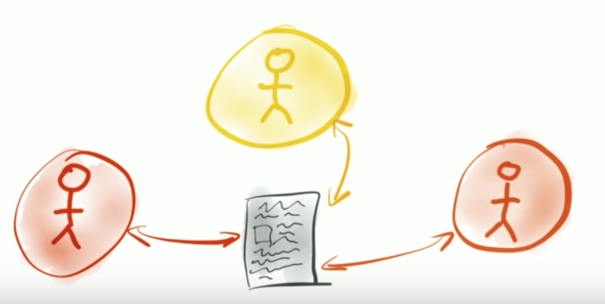
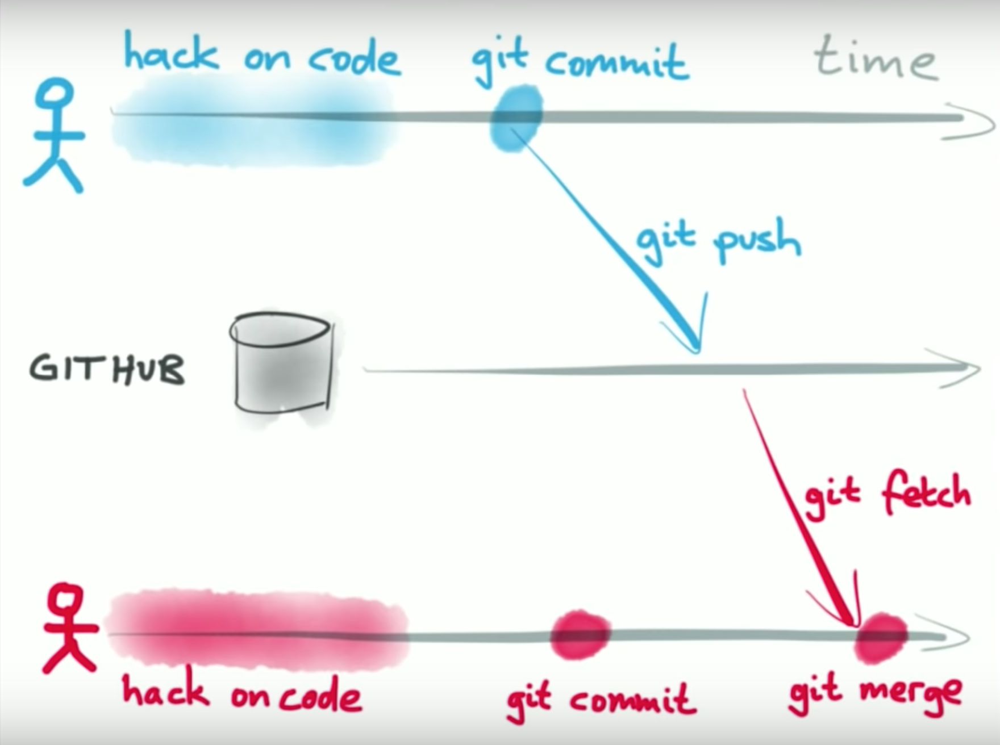
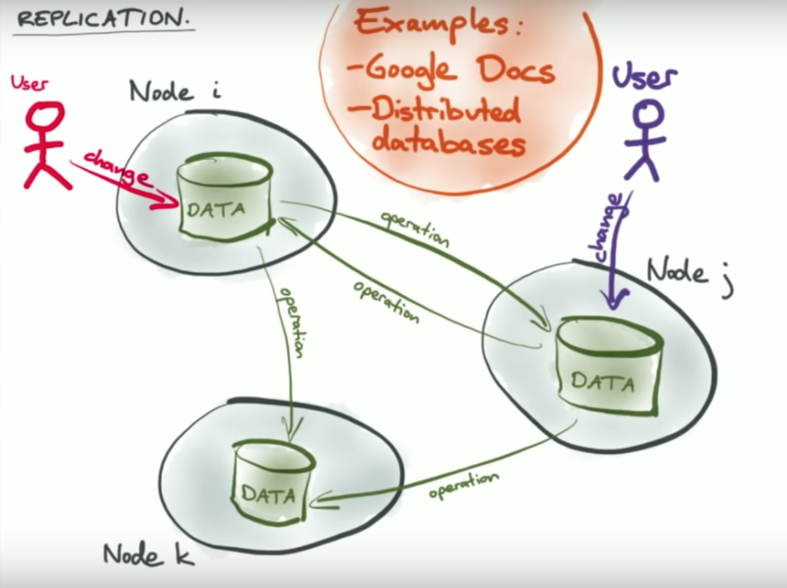
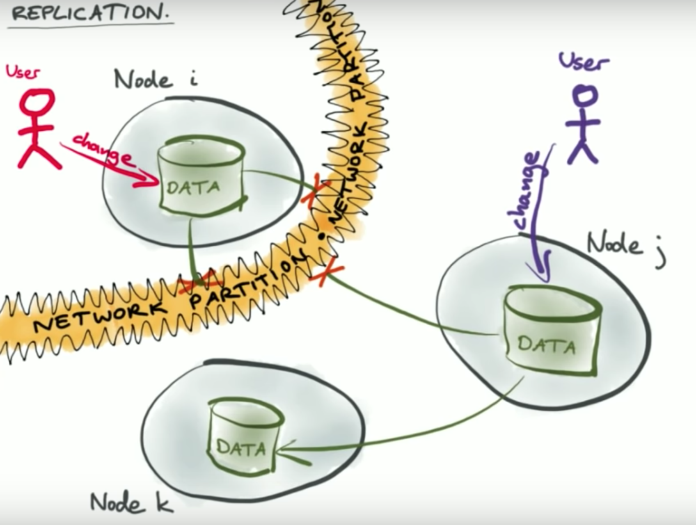
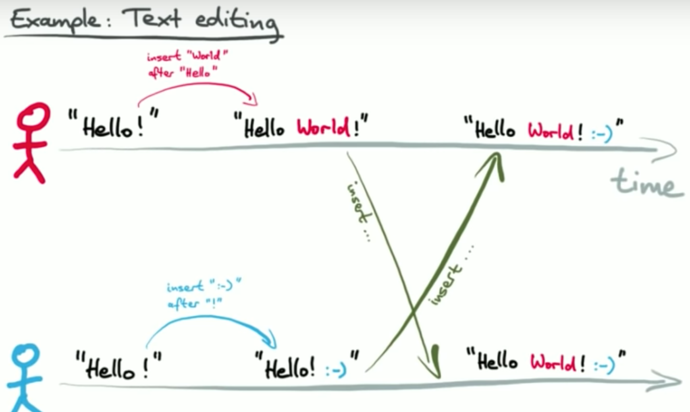
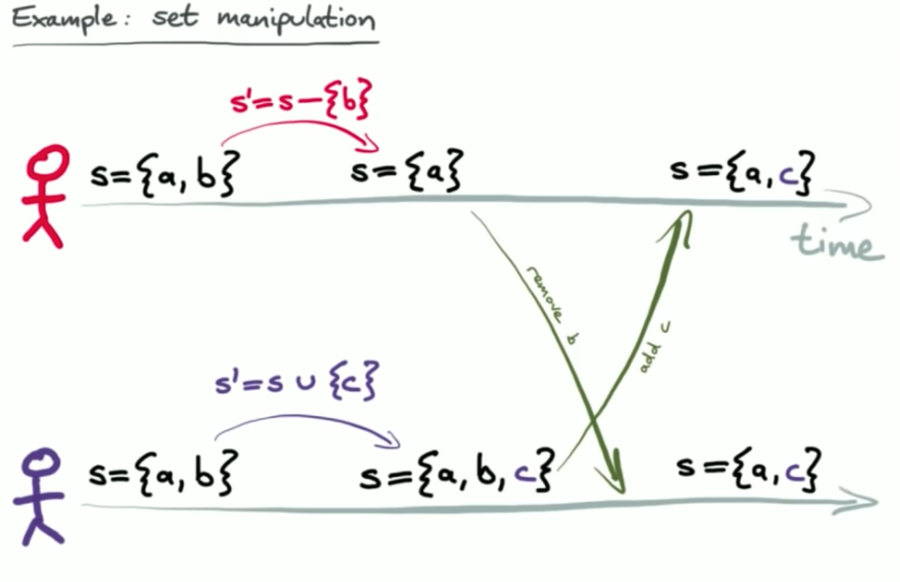
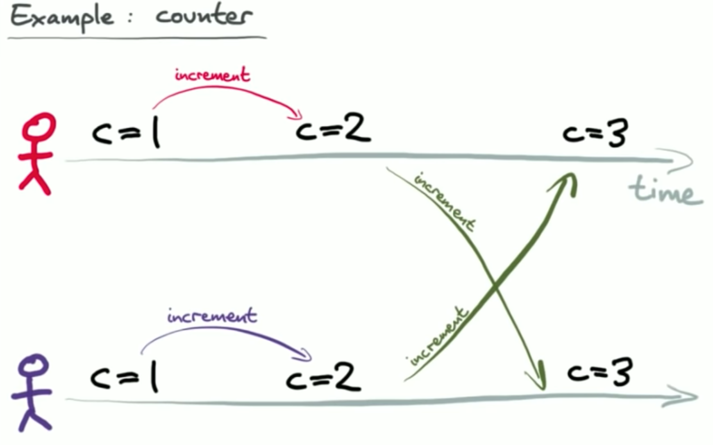
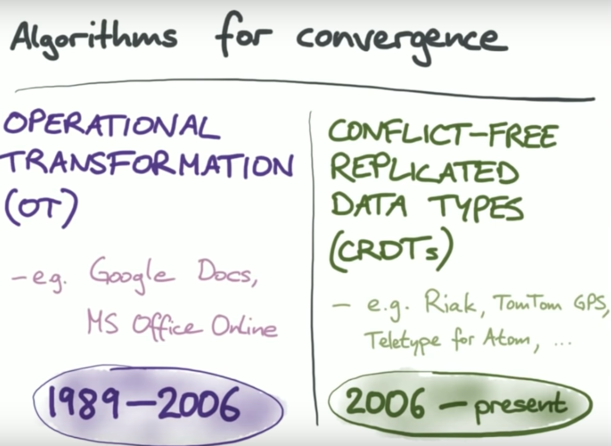
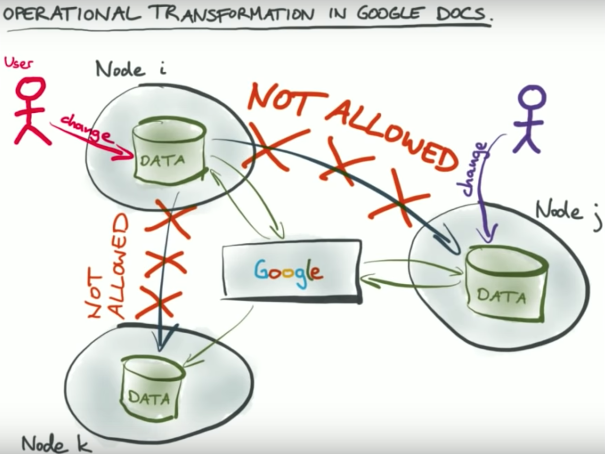
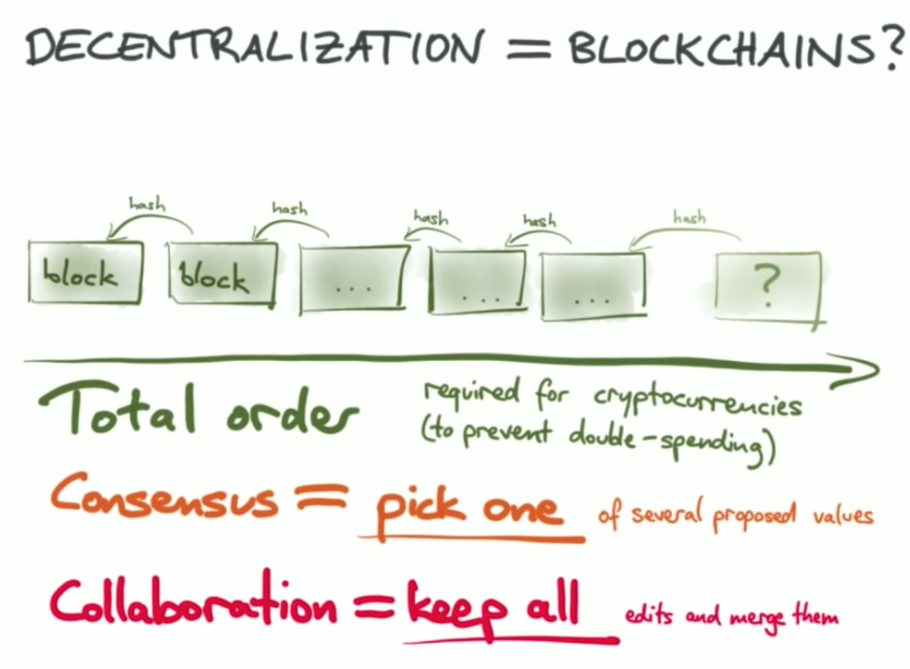

# Collaborative Applications
## Google doc 
- Several people collaborate at the same time
- Without send email to each other
- Even several people are updating document at the same time; we would like to make sure that eventually document should be updated with all writes
- This is called convergence property i.e. at the end everyone should have one copy

## Git flow system
- Second user will have to fetch to push his/her changes
- If there is no conflict then git will merge both changes
- If there is conflict then it must be resolved manually

## Replication flow to show similarity between gitflow and Google doc
- On type; Google doc first make in memory changes to immediately show the changes
- Behind the scene; Google doc sends delta changes to server 
- Sever then notify to all other client on these delta changes
- Each client then apply these delta changes automatically

## Offline editing
- Either due to network disruption or no internet; user changes will be stored in local copy
- Once user comes online then Google doc sends the changes to server which then send to all other connected clients

## Google doc on text edit
- Google doc will never show conflict if it happens
- Google doc will apply English grammar to get the best possible arrangement to merge two changes

## Google doc edit on set data
- In case of known data structure for eg set, Google doc will apply meaningful changes
- One approach is; not to change anything if data was not edited by user
- Merge two sets

## Google doc edit on counter
- One user increment
- Second user increment
- Final value is incremented by two
- i.e. it's not always just to maintain the final value
- Need to consider the sequence of changes made on data

# Algorithm for Convergence
- 1986 to 2006; Operational Transformation (OT) algorithm was used to solve this type of problem
- Google Doc, online Microsoft doc implemented this algorithm
- But due to many problem; developer was super frustrated
- 2006 onwards; a group started Conflict Free Replicated Data Type (CRDT)

## OT in Google dod based on single server approach

## Consensus protocol vs Collaboration

# Automerge
https://github.com/automerge/automerge
- Based on without any server
- Based on WebRTC 
- Transfer edit made using CRDT over WebRTC
- This was implemented by simply maintain the history of changes
- Automerge doesn't have it's own network
- You can pick and choose network of your choice
- It maintain list of logs for each operations
- It stores all operations similar to git
- It does support time travel
- 
# Reference
https://www.youtube.com/watch?v=B5NULPSiOGw
