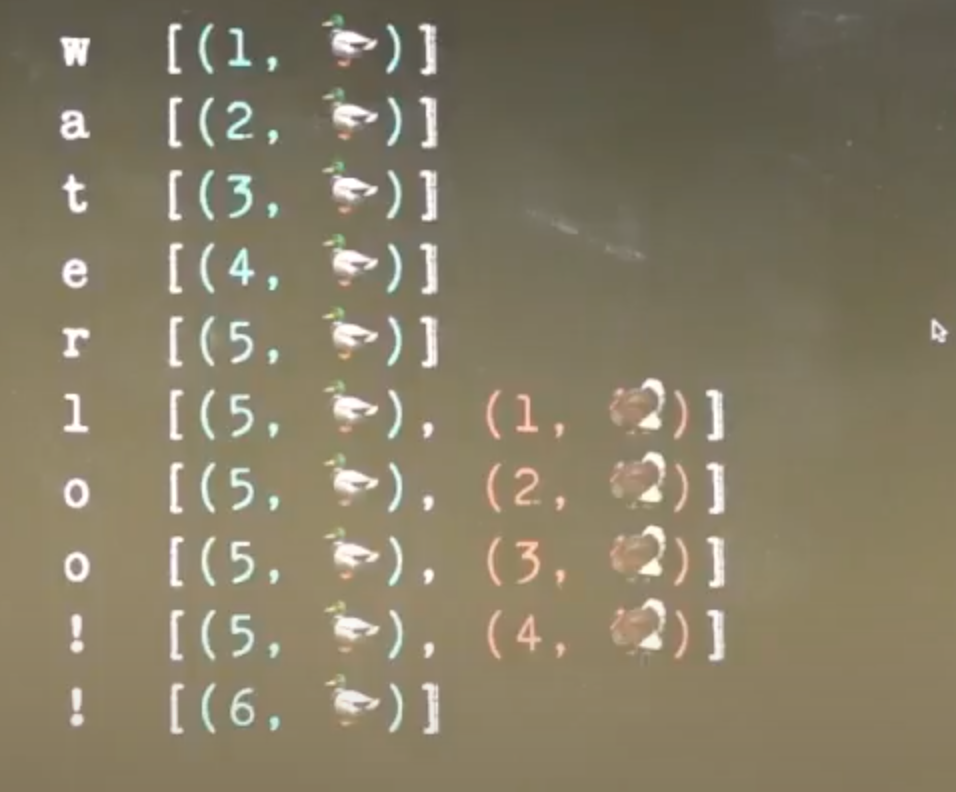

# Collaborative Applications
## Google doc 
- Several people collaborate at the same time
- Without send email to each other
- Even several people are updating document at the same time; we would like to make sure that eventually document should be updated with all writes
- This is called convergence property i.e. at the end everyone should have one copy

## Git flow system
- Second user will have to fetch to push his/her changes
- If there is no conflict then git will merge both changes
- If there is conflict then it must be resolved manually

## Replication flow to show similarity between gitflow and Google doc
- On type; Google doc first make in memory changes to immediately show the changes
- Behind the scene; Google doc sends delta changes to server 
- Sever then notify to all other client on these delta changes
- Each client then apply these delta changes automatically

## Offline editing
- Either due to network disruption or no internet; user changes will be stored in local copy
- Once user comes online then Google doc sends the changes to server which then send to all other connected clients

## Google doc on text edit
- Google doc will never show conflict if it happens
- Google doc will apply English grammar to get the best possible arrangement to merge two changes

## Google doc edit on set data
- In case of known data structure for eg set, Google doc will apply meaningful changes
- One approach is; not to change anything if data was not edited by user
- Merge two sets

## Google doc edit on counter
- One user increment
- Second user increment
- Final value is incremented by two
- i.e. it's not always just to maintain the final value
- Need to consider the sequence of changes made on data

# Algorithm for Convergence
- 1986 to 2006; Operational Transformation (OT) algorithm was used to solve this type of problem
- Google Doc, online Microsoft doc implemented this algorithm
- But due to many problem; developer was super frustrated
- 2006 onwards; a group started Conflict Free Replicated Data Type (CRDT)

## Failure of Operational Transformations
- Many algorithm failed as it was not able to achieve convergence
- Lead to two copy of document

## OT in Google doc based on single server approach
- Require centralized server
- Changed must be exchange via central server
- All data/changes must go through cental server
- Even as a user, you are modifying your doc on phone vs laptop which is physically near, data/changes needs to route through central server

## Decentralized convergence idea
- User on same LAN should be able to synchronize
- Users should be able to synchronize over internet 

## Consensus protocol vs Collaboration vs Decentralization
- Is it something to do with blockchain?
- Block chain concepts is based on without trust on central servers

Few points on block chain
- It contains block of data
- each subsequent block keeps cryptography hash of previous block
- I.e. if you have signature of hash, you can follow entire block chain which gives you guarantee of integrity
- Block chain is some kind of consensus protocol
- Which decides what would be next block of chain
- Byzantine consensus protocol tolerates some of nodes may be actively malicious, despite the presence of malicious nodes, this should agreed on next block

- If two user made bitcoin transaction
- You need to make sure that two transaction used same bitcoin was a valid transaction or not
- consensus: pick one of several proposed value and throw rest (used by block chain)
- collaborations: keep all i.e. edit and merge them all (use by online text edit)

# Operational Transformation
- Every changes are represented as operation
- if required, transformed operation
Following is one example on how OT works
  - Server and client has original document

  - Client 1 decided to insert `X`

  - Client 2 decided to insert `Y`

  - Server apply changes of client1 and client 2

  - Server sends updated changes to clients

Following are properties of OT
- It can resolves all types of conflicts in an acceptable way without human intervention
- It is good at preserving the intent of changes
- It works well with central source of state
- it can handle offline working ok
- Works well with series of changes as source of truth
- It is relatively easy to reson about
## JSON Patch
- A format to describe changes in JSON document
- It is essential as operations in OT
- Standard way to describe ops

## How it works between Server and client?
- Sever stores snapshot of documents changes in order of speedup

- Client makes local changes and send last changeId to server

- Server looks for last changeId and replay operations

- Sever sends all missing changes, including the one(s) just received

- Client reapply all new changes received from the server which include the last change

https://github.com/ThreadsStyling/json-patch-ot
# Differential Synchronization
- Used by .git or .svn
- It require manual intervention
# Conflict Free Replicated Data Types
- A family of data structure, where several people are updating same data which at the end merge to single one
- Should be commutative and idempotent operation

- Example of non idempotent operations
    - Changes are made locally
    
    - After applied locally send messages to each other
    
    
- Change operation design to make it idempotent
    - Change add operation to give a globally unique id
    - remove operation will take a id to remove
    
    - Send operations to peers
    
    - Final result
    
- Apply same on text editing
    - Its implied that character comes in some order
    - Each character will have it's on id
    
    - Same character in text
    
    - Insert between two characters to fix spelling mistake
    - Add id 5.5 to insert `r`
    
    - We wanted to have globally unique id for this file
    - If two users try to fix this typo then it will create problem
    - Soln approach is, combine fractional id to unique id generation
    - Let's say two users are editing the text
    - ducks type `water`
    - We generate id 1 to 6 as well as duck userid is also tagged
    
    - If turkey wants to add `Loo`!, there is no room between id 5 and 6
    - We can create id as 5.1, 5.2 etc plus the id of Turkey user
    
    - If Duck decided to add `honk`, it will run out of space, it will generate id as 5.3.1, 5.3.2 with user ids
    
    - If same user deletes and re-insert same characters
    - In this case, even with userid, it may generates the same fraction i.e. id
    - We can add timestamp i.e. incremental counter on everytime user makes changes
    
    - I.e. wherever we typed a new character, it will generate the new id
    - In case of delete, instead of giving character or position to delete, you will give id of character to delete
    - Now every operations operate on unique id
    - Since operations are cumulative and idempotent so convergence is easy
- Change operation design to support idempotent 
- Atom editor uses CRDT
- React database uses CRDT

Used isabelle to prove that CRDT works

https://dl.acm.org/doi/10.1145/3133933

# Automerge
https://github.com/automerge/automerge
- Implementation of CRDT
- Is a data structure library which can be used to build other applications
- Based on without any server
- Based on peer to peer network
- Based on WebRTC (generally used to enable video call on web browser, here is used to transfer data)
- Transfer edit made using CRDT over WebRTC
- This was implemented by simply maintain the history of changes
- Automerge doesn't have it's own network
- You can pick and choose network of your choice
- It maintain list of logs for each operations
- It stores all operations similar to git
- It does support time travel

Following are few sample project using automerge
- Trilo clone: Based on WebRTC peer to peer

- collaborative Pixels of art

# Reference
https://www.youtube.com/watch?v=B5NULPSiOGw
https://www.youtube.com/watch?v=jIR0Ngov7vo
